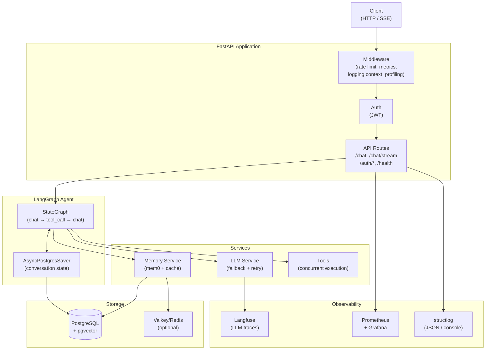
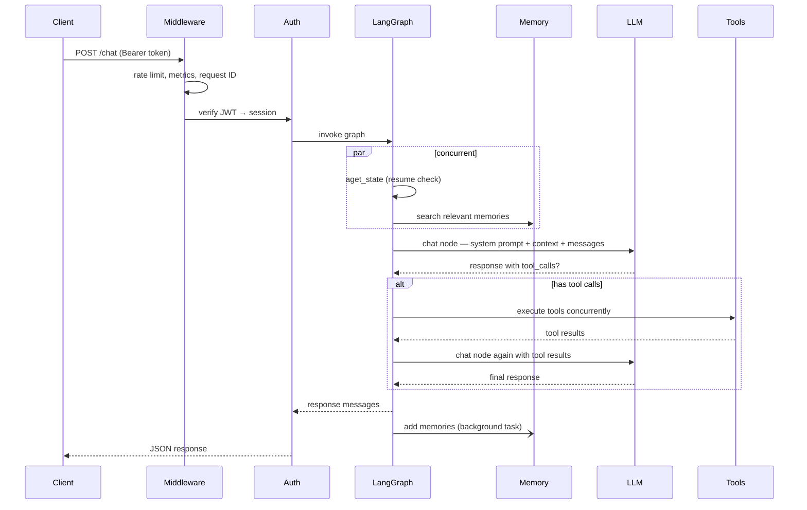
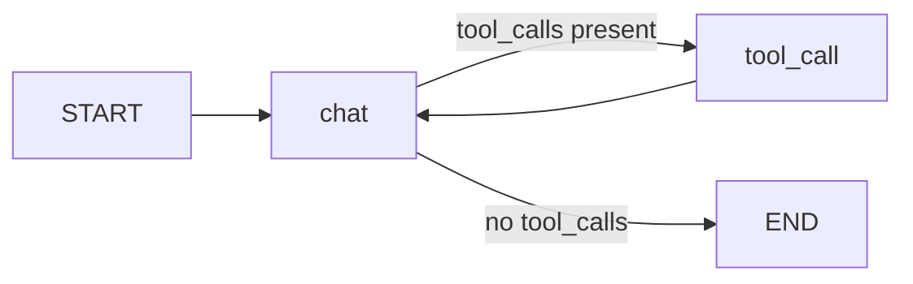

# Architecture

## System overview

## Request lifecycle

## Agent graph

The agent is a two-node `StateGraph`:

- **`chat` node** — builds the system prompt, calls the LLM, returns a `Command` routing to `tool_call` or `END`
- **`tool_call` node** — executes all tool calls concurrently, feeds results back to `chat`
- **Checkpointer** — `AsyncPostgresSaver` persists the full `GraphState` per `thread_id` (session), enabling resume on interrupts and multi-turn memory

## Key design decisions

**Memory search and state check run concurrently.** On every non-resumed request, `aget_state` (to check for interrupts) and `memory.search` (to fetch relevant memories) run in parallel with `asyncio.gather`, saving 200–500ms per request.

**Tool calls execute concurrently.** When the LLM returns multiple tool calls in one response, they all execute in parallel via `asyncio.gather`.

**System prompt cached at module load.** `system.md` is read once at startup. Per-request cost is only `.format()` with the user's name, current datetime, and retrieved memories — no file I/O.

**LLM fallback is time-bounded.** The entire fallback loop (retries × models) is wrapped in `asyncio.wait_for(timeout=LLM_TOTAL_TIMEOUT)` to prevent indefinite hangs.

**Username flows through session, not per-request DB lookup.** The user's display name is copied to `Session.username` at session creation time. Chat requests read it from the already-loaded session object — zero extra queries.

**Session titles are generated with zero added latency.** On the first message of an unnamed session, the API atomically claims the session with a placeholder name (a truncated version of the user's message), then fires a background `asyncio.Task` to call a fast nano model with structured output. The main chat response is returned immediately — title generation runs concurrently. An atomic `UPDATE … WHERE name = ''` in Postgres ensures exactly one worker wins the claim even under concurrent requests.

## Component responsibilities

| Component | File | Responsibility |
|---|---|---|
| LangGraph Agent | `app/core/langgraph/graph.py` | Orchestrates the conversation loop |
| LLM Service | `app/services/llm/` | Model registry, retries, circular fallback, structured output |
| Memory Service | `app/services/memory.py` | mem0 semantic memory + cache |
| Session Naming | `app/services/session_naming.py` | Background LLM title generation for new sessions |
| Database Service | `app/services/database.py` | User/session CRUD |
| Cache Service | `app/core/cache.py` | Valkey/Redis with in-memory fallback |
| Middleware | `app/core/middleware.py` | Metrics, logging context, profiling |
| Auth | `app/api/v1/auth.py` | JWT creation, session management |
