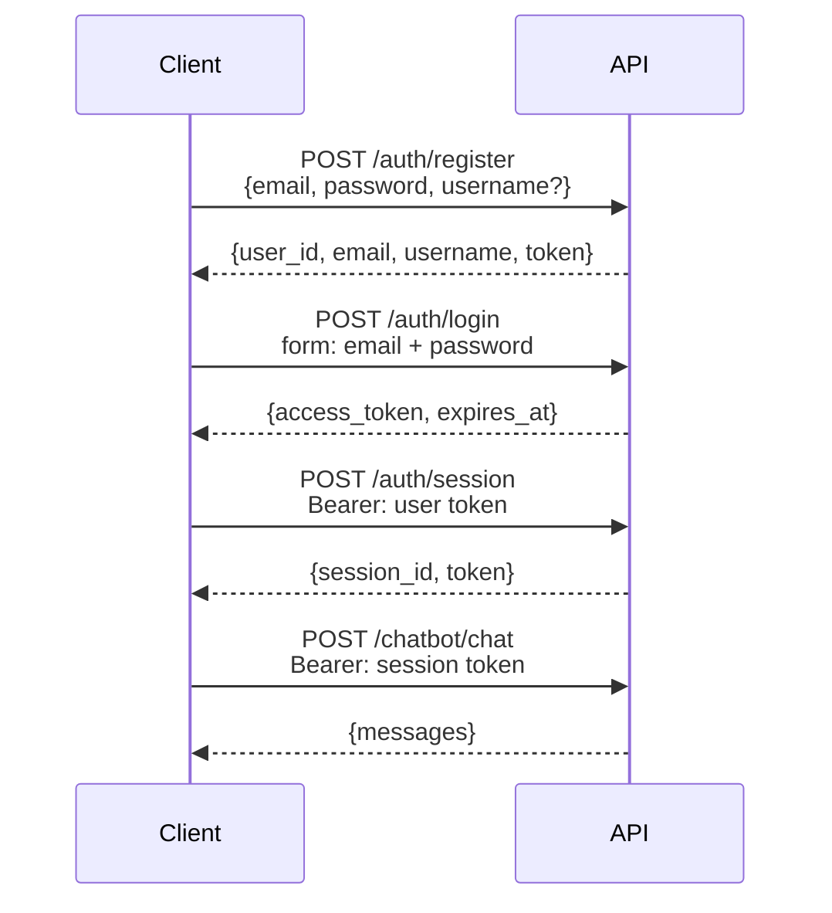

# Authentication

## Flow



The API uses **two token scopes**:

- **User token** — issued on register/login, identifies the user. Used to create and list sessions.
- **Session token** — issued per conversation session. Required for all chat endpoints. Scoped to a single `session_id`.

Both are signed JWTs (HS256) with a configurable expiry (`JWT_ACCESS_TOKEN_EXPIRE_DAYS`).

---

## Endpoints

### `POST /api/v1/auth/register`

Create a new account.

```json
{
  "email": "you@example.com",
  "password": "Secret123!",  // pragma: allowlist secret
  "username": "you"
}
```

Password requirements: 8+ chars, uppercase, lowercase, number, special character.

`username` is optional. When provided, it's passed to the agent's system prompt so the LLM knows the user's name.

---

### `POST /api/v1/auth/login`

Exchange credentials for a user token. Uses OAuth2 password grant form fields.

```bash
curl -X POST /api/v1/auth/login \
  -F "email=you@example.com" \
  -F "password=Secret123!" \
  -F "grant_type=password"
```

Returns `access_token` and `expires_at`.

---

### `POST /api/v1/auth/session`

Create a new chat session. Requires a valid user token.

```bash
curl -X POST /api/v1/auth/session \
  -H "Authorization: Bearer <user token>"
```

Returns `session_id` and a session-scoped `token`. Use this session token for all subsequent chat requests.

---

### `PATCH /api/v1/auth/session/{session_id}/name`

Rename a session.

```bash
curl -X PATCH /api/v1/auth/session/{session_id}/name \
  -H "Authorization: Bearer <session token>" \
  -F "name=My research session"
```

---

### `DELETE /api/v1/auth/session/{session_id}`

Delete a session and its chat history.

---

### `GET /api/v1/auth/sessions`

List all sessions for the authenticated user. Requires a user token.

---

## Security notes

- Passwords are hashed with bcrypt before storage — plaintext is never persisted.
- JWTs include a `jti` (JWT ID) claim for token uniqueness.
- All string inputs are sanitised before use.
- Rate limits protect the register (10/hour) and login (20/min) endpoints against brute force.
- Set a long random `JWT_SECRET_KEY` in production — at least 32 characters.
