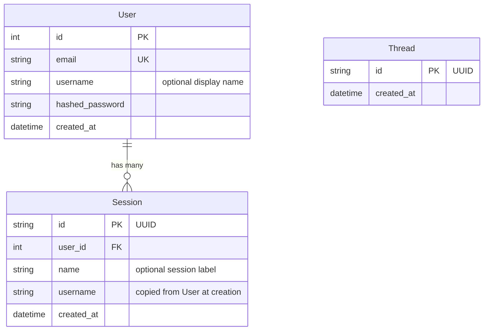

# Database & Migrations

## Schema



**User** — one per account. Email is unique. `username` is optional and used to personalise the system prompt.

**Session** — one per conversation. A user can have many sessions. `username` is denormalised from `User` at creation time so chat requests never need an extra DB lookup. The session JWT scopes all chat requests.

**Thread** — mirrors LangGraph's `AsyncPostgresSaver` checkpoint thread. Tracks which threads exist in the app's context.

The LangGraph checkpointer also creates its own tables (`checkpoints`, `checkpoint_blobs`, `checkpoint_writes`) — these are managed by LangGraph itself, not by Alembic.

pgvector creates a `longterm_memory` collection table managed by mem0 — also not by Alembic.

---

## Migrations with Alembic

All schema changes are managed through Alembic. The app no longer calls `create_all()` on startup — Alembic owns the schema.

### Initial setup (fresh database)

```bash
make migrate              # applies all migrations to the database
```

### Creating a migration after model changes

```bash
# 1. Edit your SQLModel model (app/models/)
# 2. Generate the migration
make migration MSG="add phone number to user"

# 3. Review the generated file in alembic/versions/
# 4. Apply it
make migrate
```

### Other commands

```bash
make migrate-downgrade    # roll back the last migration
make migrate-history      # show the full migration history
```

Alembic reads DB credentials from your `.env` file (via `app/core/config.py`). Make sure the correct `APP_ENV` is set before running migrations.

### How autogenerate works

`env.py` imports all SQLModel models so their metadata is registered, then calls `alembic revision --autogenerate`. Alembic diffs the current DB schema against the models and generates the upgrade/downgrade functions.

External tables (LangGraph checkpointer, mem0, pgvector) are excluded via `include_object` in `alembic/env.py` so Alembic never touches them.

### Adding a new model

1. Create `app/models/your_model.py`
2. Import it in `alembic/env.py` alongside the other model imports
3. Run `make migration MSG="add your_model table"`

---

## Adding pgvector to a fresh database

pgvector must be enabled before running migrations:

```sql
CREATE EXTENSION IF NOT EXISTS vector;
```

With Docker (`make docker-up`), this is handled automatically by the `db` service. For external databases (e.g. Supabase), enable the extension via the dashboard or SQL editor.
