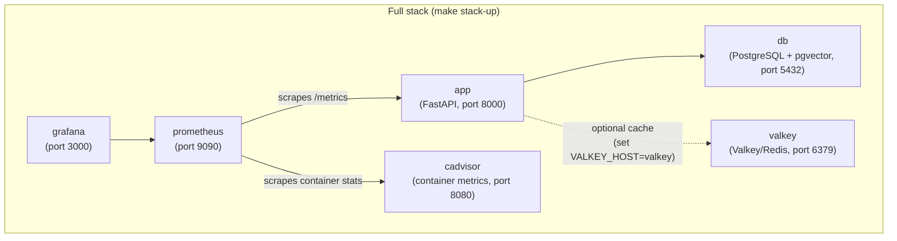

# Docker

## Services



Valkey is always started but only used by the app when `VALKEY_HOST=valkey` is set in your `.env` file. Without it the app falls back to an in-memory cache.

## Commands

### API + database only (most common for development)

```bash
make docker-up ENV=development     # start
make docker-down ENV=development   # stop
make docker-logs ENV=development   # tail logs
```

### Full stack (includes Prometheus + Grafana)

```bash
make stack-up ENV=development      # start everything
make stack-down ENV=development    # stop everything
make stack-logs ENV=development    # tail all service logs
```

### Build a custom image

```bash
make docker-build ENV=production
```

This runs `scripts/build-docker.sh` which builds and tags the image for the specified environment.

## Running migrations inside Docker

After `make docker-up`, run migrations against the containerised database:

```bash
make migrate ENV=development
```

This sources the correct `.env` file and runs `alembic upgrade head` from your local machine, connecting to the containerised PostgreSQL.

## Environment files

Each environment needs a `.env.<env>` file:

```bash
cp .env.example .env.development
cp .env.example .env.staging
cp .env.example .env.production
```

The `docker-up` and `stack-up` commands pass the env file to Docker Compose via `--env-file`. Make sure `POSTGRES_HOST=db` in your Docker env files (not `localhost`) — the service name within the Compose network is `db`.

## Grafana

After `make stack-up`, Grafana is available at [http://localhost:3000](http://localhost:3000).

Default credentials: `admin` / `admin`

Pre-configured dashboards (in `grafana/`):

- API performance (request rate, latency, error rate)
- Rate limiting statistics
- Database connection pool health
- System resource usage
