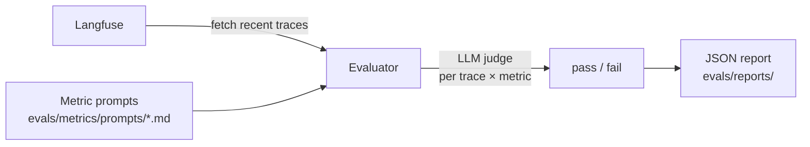

# Evaluation

The template includes a metric-based evaluation framework that fetches traces from Langfuse, scores them with LLM judges, and generates JSON reports.

## Running evaluations

```bash
make eval                        # interactive mode — prompts for settings
make eval-quick                  # runs with defaults, no prompts
make eval-no-report              # runs but skips report generation
make eval ENV=production         # run against production traces
```

## How it works



1. **Fetch traces** — pulls recent LLM traces from Langfuse (configured via `LANGFUSE_*` env vars)
2. **Score** — for each trace × metric combination, an LLM judge evaluates the output and returns pass/fail
3. **Report** — a JSON report with aggregated stats and per-trace results is saved to `evals/reports/`

## Built-in metrics

| Metric | What it checks |
| --- | --- |
| `helpfulness` | Did the response actually help the user? |
| `conciseness` | Was the response appropriately concise? |
| `hallucination` | Did the response contain made-up facts? |
| `relevancy` | Was the response on-topic? |
| `toxicity` | Did the response contain harmful content? |

## Adding a custom metric

1. Create a markdown file in `evals/metrics/prompts/`:

```markdown
# My Metric

Evaluate whether the assistant response...

## Scoring

Return "pass" if... Return "fail" if...
```

2. The evaluator auto-discovers and applies all `.md` files in that directory.

## Report format

Reports are saved to `evals/reports/evaluation_report_YYYYMMDD_HHMMSS.json`:

```json
{
  "summary": {
    "total_traces": 50,
    "success_rate": 0.92,
    "duration_seconds": 34.2
  },
  "metrics": {
    "helpfulness": {"pass": 48, "fail": 2, "rate": 0.96},
    "hallucination": {"pass": 45, "fail": 5, "rate": 0.90}
  },
  "traces": [...]
}
```

## Eval LLM configuration

The evaluator uses a separate LLM config so you can use a different (cheaper) model for judging:

```bash
EVALUATION_LLM=gpt-5
EVALUATION_API_KEY=...   # defaults to OPENAI_API_KEY if not set
```
