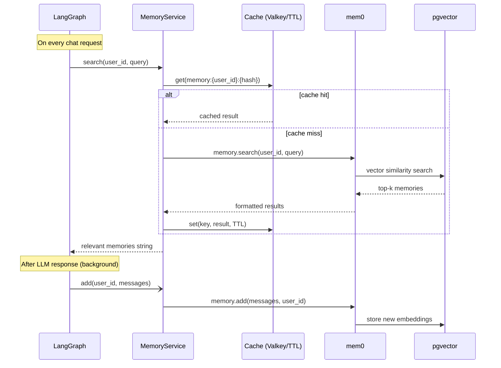

# Memory

## Overview

The template includes a long-term memory system powered by [mem0](https://github.com/mem0ai/mem0) and pgvector. Memories are extracted from conversations, stored as vector embeddings, and retrieved semantically on each request — giving the agent context from past sessions.

## How it works

## Cache layer

Memory search results are cached to avoid repeated pgvector queries for similar questions within the same TTL window.

- **With Valkey/Redis**: cache is shared across app instances. Set `VALKEY_HOST` in your `.env`.
- **Without Valkey**: falls back to an in-memory `TTLCache` — works fine for single instances.

Cache key: `memory:{user_id}:{sha256(query)[:16]}`
TTL: `CACHE_TTL_SECONDS` (default: 60s)

Only successful, non-empty results are cached. Errors are never cached.

## Memory updates

After the LLM produces a response, memories are updated **in the background** via `asyncio.create_task`. This means:
- The response is returned immediately, without waiting for mem0 to finish
- Memory updates don't block or slow down the chat response

## Configuration

| Variable | Default | Description |
| --- | --- | --- |
| `LONG_TERM_MEMORY_COLLECTION_NAME` | `longterm_memory` | pgvector collection name |
| `LONG_TERM_MEMORY_MODEL` | `gpt-5-nano` | LLM used by mem0 to extract and process memories |
| `LONG_TERM_MEMORY_EMBEDDER_MODEL` | `text-embedding-3-small` | Embedding model for semantic search |
| `CACHE_TTL_SECONDS` | `60` | Memory search cache TTL |

## Startup pre-warming

At startup, `memory_service.initialize()` is called in the app lifespan. This establishes the pgvector connection pool and runs mem0's schema check, so the first user request doesn't pay the ~130ms cold-init cost.

## Per-user isolation

Each user's memories are stored and searched independently using `user_id` as the namespace. Users cannot access each other's memories.
