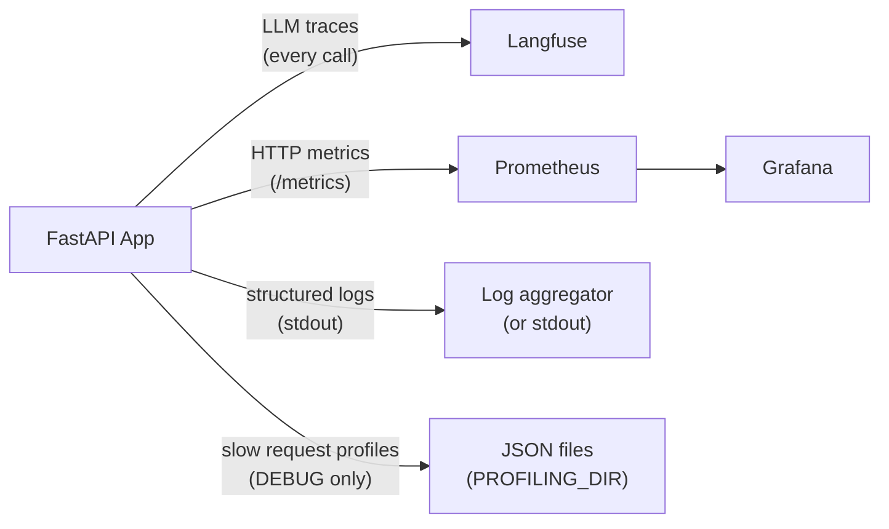

# Observability

## Overview



---

## Langfuse — LLM tracing

Every LLM call is traced via the LangChain `CallbackHandler`. Traces include:

- Input messages and output
- Token usage and cost
- Latency per call and per session
- Model name, temperature, and other parameters

**Setup:**

```bash
LANGFUSE_TRACING_ENABLED=true
LANGFUSE_PUBLIC_KEY=pk-...
LANGFUSE_SECRET_KEY=sk-...
LANGFUSE_HOST=https://cloud.langfuse.com   # or your self-hosted URL
```

**Disable for local dev:**

```bash
LANGFUSE_TRACING_ENABLED=false
```

Traces are also used as the data source for the [evaluation framework](evaluation.md).

---

## Structured logging

All logs use [structlog](https://www.structlog.org/) in a consistent format:

- **Development**: coloured console output
- **Production**: JSON (pipe to your log aggregator)

Every log line automatically carries `request_id`, `session_id`, and `user_id` when available — bound by `LoggingContextMiddleware`.

### Log format conventions

```python
# Good
logger.info("chat_request_received", session_id=session.id, message_count=5)

# Never
logger.info(f"chat request received for {session.id}")  # no f-strings
logger.error("something failed", error=str(e))          # use logger.exception for exceptions
```

Rules:

- Event names are `lowercase_with_underscores`
- Variables are keyword arguments, never interpolated into the event string
- Use `logger.exception()` (not `.error()`) when inside an `except` block — preserves the full traceback

### Log levels by environment

| Environment | Level |
| --- | --- |
| development | DEBUG |
| staging | INFO |
| production | WARNING |

---

## Prometheus metrics

Metrics are exposed at `GET /metrics` and scraped by Prometheus.

| Metric | Type | Description |
| --- | --- | --- |
| `http_requests_total` | Counter | Request count by method, endpoint, status |
| `http_request_duration_seconds` | Histogram | Request latency by method, endpoint |
| `llm_inference_duration_seconds` | Histogram | LLM call latency by model |
| `llm_stream_duration_seconds` | Histogram | Streaming call latency by model |
| `db_connections` | Gauge | Active database connections |

Grafana dashboards are pre-configured in `grafana/`. Start the full stack with `make stack-up ENV=development` to access them at [http://localhost:3000](http://localhost:3000) (admin/admin).

---

## Request profiling (debug only)

When `DEBUG=true`, `ProfilingMiddleware` profiles every request using [pyinstrument](https://github.com/joerick/pyinstrument). When a request exceeds `PROFILING_THRESHOLD_SECONDS`, a JSON report is saved to `PROFILING_DIR`.

Each report file is named `{request_id}.json` and contains:

```json
{
  "request_id": "...",
  "endpoint": "POST /api/v1/chatbot/chat",
  "wall_time_ms": 1842,
  "cpu_time_ms": 145,
  "io_wait_ms": 1697,
  "memory_peak_kb": 4820,
  "top_memory_allocators": [...],
  "call_tree": {...}
}
```

Set `PROFILING_THRESHOLD_SECONDS=0` to profile every request.

The `request_id` in the filename matches the `X-Request-ID` response header, so you can correlate profiles with specific log lines.

---

## Request ID propagation

Every request gets a unique `X-Request-ID` header via [`asgi-correlation-id`](https://github.com/snok/asgi-correlation-id). This ID is:

- Returned in the response headers
- Bound to every log line for that request
- Used as the filename for profile reports

Use the `X-Request-ID` from a response to grep logs, find profiles, and look up Langfuse traces for that exact request.
